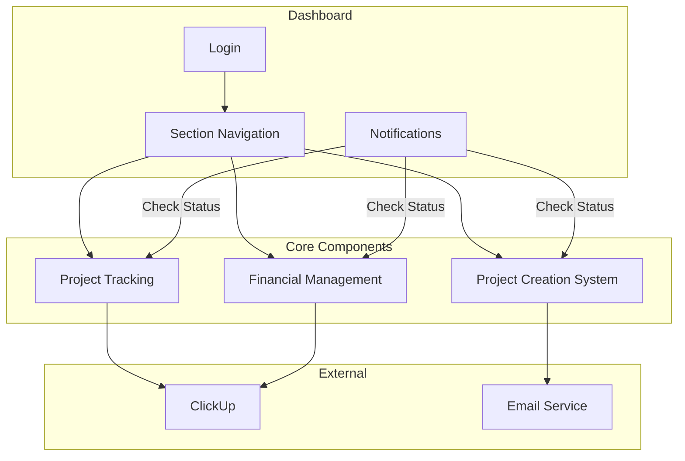
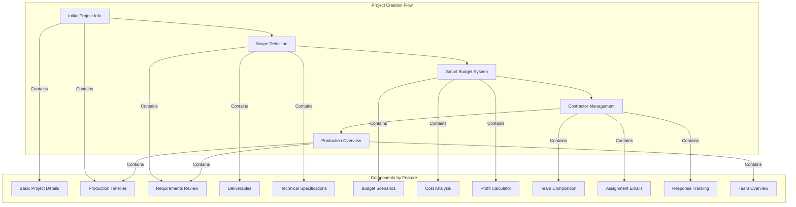
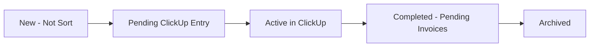
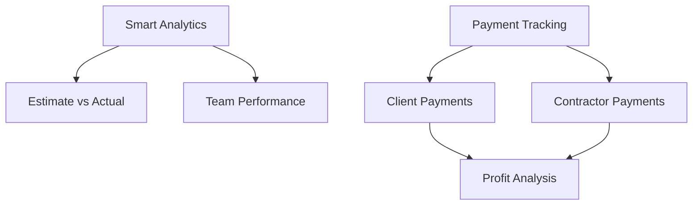
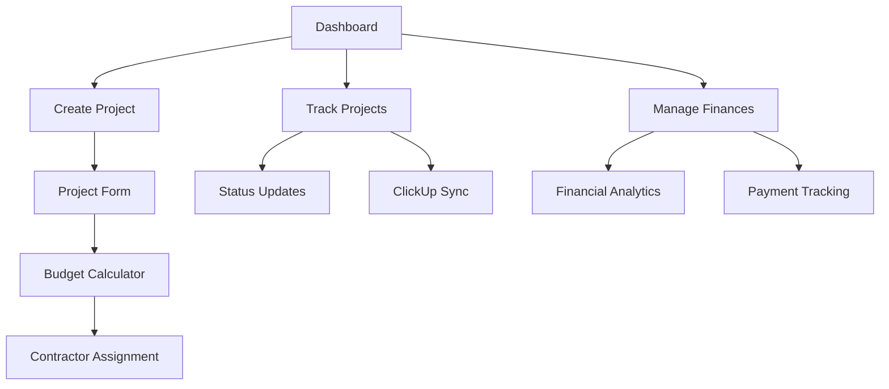
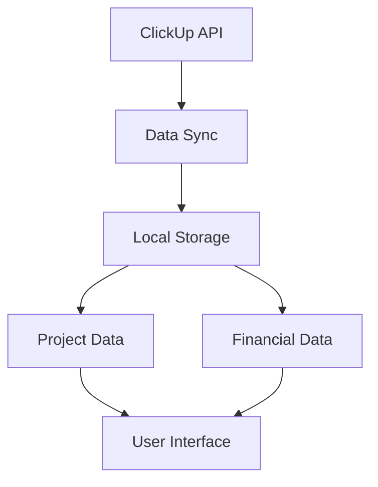

# Current Media Project Management System - System Patterns

## System Architecture

The Current Media Project Management System follows a clean, efficient architecture focused on three core components with a simple dashboard interface.

## Component Structure

### 1. Project Creation System

The project creation system follows a feature-based organization with clear separation of concerns:

#### Component Structure

1. **Initial Project Info (`InitialProjectInfo.tsx`)**
   - Project title and client details
   - Timeline configuration
   - Initial budget estimation
   - Basic project parameters

2. **Scope Definition (`ScopeDefinition.tsx`)**
   - Project requirements list
   - Deliverables management
   - Technical requirements
   - Priority settings
   - Additional notes

3. **Smart Budget System (`SmartBudgetSystem.tsx`)**
   - Multiple budget scenarios
   - Cost breakdown analysis
   - Profit margin calculator
   - Risk assessment
   - Contingency planning

4. **Contractor Management (`ContractorManagement.tsx`)**
   - Team composition
   - Email assignment system
   - Response tracking
   - Rate management
   - Availability confirmation

5. **Production Overview (`ProductionOverview.tsx`)**
   - Timeline visualization
   - Team overview
   - Requirements summary
   - Budget overview
   - Production readiness check

### 2. Project Tracking

### 3. Financial Management

## Key Technical Decisions

### Frontend Design
- Clean, efficient dashboard layout
- Simple navigation between sections
- Status-based notification system
- Minimal, focused UI components

### Backend Structure
- Basic API endpoints for core functionality
- Simple data synchronization with ClickUp
- Efficient email service integration
- Straightforward data storage

### Data Management
- Focus on essential project data
- Simple, efficient data structures
- Basic data validation
- Practical error handling

### Authentication
- Basic single-user login
- Simple session management
- No complex user roles needed

## Design Patterns

### Frontend Patterns

1. **Component Pattern**
   - Clean, focused components
   - Clear component hierarchy
   - Simple state management

2. **Dashboard Pattern**
   - Central navigation hub
   - Status notifications
   - Quick access to core functions

3. **Form Pattern**
   - Step-by-step project creation
   - Clear validation feedback
   - Progress saving

### Backend Patterns

1. **Service Pattern**
   - Focused service responsibilities
   - Clear data flow
   - Simple error handling

2. **Integration Pattern**
   - Direct ClickUp synchronization
   - Simple email notifications
   - Basic data mapping

## Component Relationships

### Project Flow

### Data Flow

## Technical Constraints

1. **Simplicity First**
   - Keep implementation straightforward
   - Focus on core functionality
   - Avoid unnecessary complexity

2. **Practical Integration**
   - Basic ClickUp data sync
   - Simple email notifications
   - Essential data storage

3. **Single User Focus**
   - Basic authentication
   - Simple session management
   - No multi-user complexity

## Evolution Strategy

The system is designed to evolve based on practical needs:

1. **Core First**
   - Build essential features
   - Ensure solid foundation
   - Test thoroughly

2. **Practical Improvements**
   - Discuss enhancements first
   - Focus on workflow benefits
   - Avoid feature bloat

3. **User-Driven Updates**
   - Regular feedback
   - Focus on efficiency
   - Practical solutions
