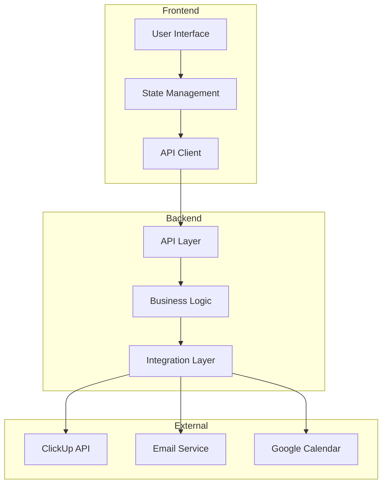
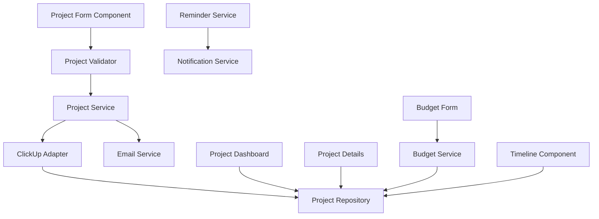
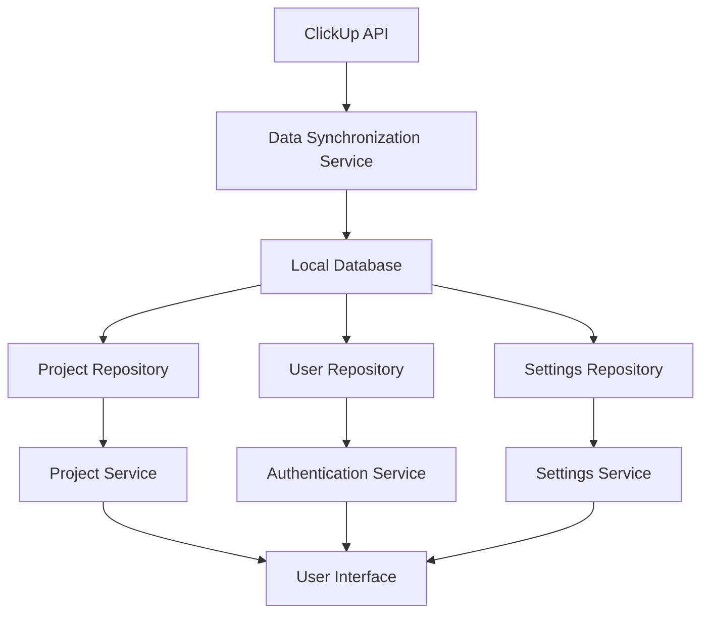

# Current Media Project Management System - System Patterns

## System Architecture

The Current Media Project Management System follows a modern web application architecture with clear separation of concerns and a focus on maintainability and extensibility.

### Key Components

1. **Frontend Layer**
   - User Interface: Responsive web interface for user interaction
   - State Management: Handles application state and UI updates
   - API Client: Manages communication with the backend API

2. **Backend Layer**
   - API Layer: Exposes endpoints for frontend consumption
   - Business Logic: Implements core application functionality
   - Integration Layer: Manages communication with external services

3. **External Services**
   - ClickUp API: Source of project data (managed by Jake)
   - Email Service: For sending project forms and notifications
   - Google Calendar: For integration with shoot day scheduling

## Key Technical Decisions

### Frontend Framework
The frontend will be built using a modern JavaScript framework that supports:
- Component-based architecture
- Reactive state management
- Efficient rendering
- Strong typing support

Potential options include:
- React with TypeScript
- Vue.js with TypeScript
- Angular

### Backend Technology
The backend will be implemented using a technology stack that provides:
- RESTful API capabilities
- Strong integration capabilities
- Efficient data processing
- Secure authentication

Potential options include:
- Node.js with Express
- Python with FastAPI or Django
- .NET Core

### Data Storage
The system will require data storage for:
- User authentication and preferences
- Local cache of ClickUp data
- System-specific data not stored in ClickUp

Potential options include:
- MongoDB for flexible document storage
- PostgreSQL for relational data with JSON support
- Firebase for real-time capabilities and authentication

### Authentication
The system will implement secure authentication to ensure only authorized users can access the application:
- JWT-based authentication
- Role-based access control
- Secure password storage
- Potential integration with existing authentication systems

## Design Patterns

### Frontend Patterns

1. **Component Pattern**
   - Reusable UI components with clear interfaces
   - Composition over inheritance
   - Container/Presentational component separation

2. **Flux/Redux Pattern**
   - Unidirectional data flow
   - Centralized state management
   - Predictable state updates

3. **Observer Pattern**
   - Event-based communication between components
   - Reactive updates based on state changes
   - Subscription to external data sources

### Backend Patterns

1. **Repository Pattern**
   - Abstraction over data sources
   - Consistent interface for data access
   - Separation of data access logic from business logic

2. **Service Pattern**
   - Encapsulation of business logic
   - Reusable services with clear responsibilities
   - Dependency injection for service composition

3. **Adapter Pattern**
   - Consistent interface for external services
   - Isolation of integration code
   - Easier testing and maintenance

4. **Command Pattern**
   - Encapsulation of operations as objects
   - Support for operation queueing and scheduling
   - Easier implementation of undo/redo functionality

## Component Relationships

### Project Management Flow

### Data Flow

## Technical Constraints

1. **ClickUp Integration**
   - Limited by ClickUp API capabilities
   - Need to handle synchronization and potential conflicts
   - Must adapt to any changes in ClickUp's API

2. **Hosting Environment**
   - Potential integration with currentmedia.ca (Wix-based)
   - Alternative hosting on render.com
   - Need to consider deployment and CI/CD pipeline

3. **Authentication**
   - Need to implement secure authentication
   - Consider integration with existing authentication systems
   - Balance security with usability

4. **Offline Capabilities**
   - Determine requirements for offline functionality
   - Consider local storage and synchronization strategies
   - Handle potential conflicts during synchronization

## Evolution Strategy

The system architecture is designed to evolve over time:

1. **Modular Design**
   - Components with clear interfaces
   - Loose coupling between modules
   - Ability to replace individual components

2. **Incremental Development**
   - Start with core functionality
   - Add features incrementally
   - Continuous integration and deployment

3. **Feedback Loop**
   - Regular user feedback
   - Usage analytics
   - Iterative improvements based on real-world usage
