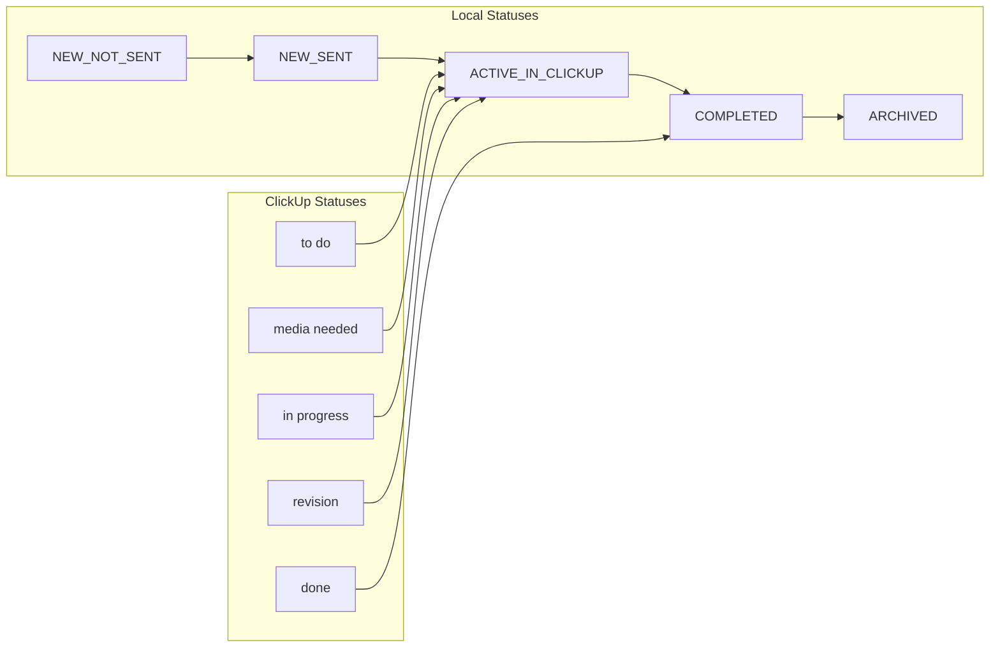

# System Patterns

## Production Deployment Pattern

### URL Structure
```
currentmedia.ca/
└── projects/
    └── management/        # Base application path
        ├── api/          # API endpoints
        ├── assets/       # Static assets
        └── projects/     # Project-specific URLs
            └── {id}/     # Individual project resources
```

### Build Configuration
- Vite configured for subdirectory deployment
- Assets properly referenced from base path
- Development vs production path handling
- Optimized chunk splitting for performance

### Server Configuration
- Express serves static files from build directory
- API routes mounted under subdirectory path
- Proper CORS configuration for production domain
- Security headers optimized for production
- Client-side routing support via catch-all route

## Project Status Flow

The system uses a combination of local statuses and ClickUp statuses to track project state:



### Local-Only Statuses
- **NEW_NOT_SENT**: New project created locally but not yet ready to send to Jake
- **NEW_SENT**: Project completed locally and sent to Jake for ClickUp creation
- **ARCHIVED**: Final status when project is complete and all invoices paid

### ClickUp-Mapped Statuses
- **ACTIVE_IN_CLICKUP**: Maps from multiple ClickUp statuses:
  - "to do"
  - "media needed"
  - "in progress"
  - "revision"
- **COMPLETED**: Maps from ClickUp's "done" status

### Status Transitions
1. Projects start as NEW_NOT_SENT when created locally
2. Once ready, they move to NEW_SENT when submitted to Jake
3. When Jake adds them to ClickUp, they become ACTIVE_IN_CLICKUP
4. When Jake marks as "done" in ClickUp, they become COMPLETED
5. Finally, they can be ARCHIVED locally once all invoices are paid

Note: The PENDING_CLICKUP status was determined to be redundant and is not used.
